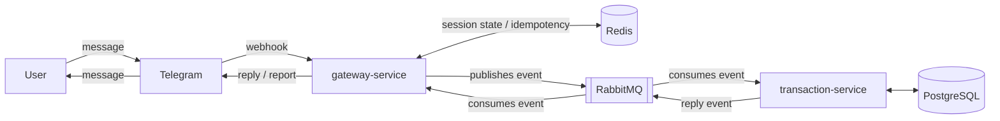

# finance-bot

Personal finance bot built with a microservices architecture in Java and Spring Boot, using asynchronous messaging for communication. Lets you manage financial transactions and generate income/expense reports through Telegram.

## Architecture

The project is split into three modules:

- **`gateway-service`** — microservice responsible for receiving Telegram webhooks and publishing the events consumed by `transaction-service`. It also consumes events to send responses back to users in the chat.
- **`transaction-service`** — microservice responsible for consuming the events published by `gateway-service`, applying business rules, driving multi-step flows, and persisting transactions. At the end of each execution, it publishes events that `gateway-service` consumes to send reply messages in the chat.
- **`finance-contracts`** — shared module with the contracts (DTOs) used for communication between the microservices.

The system follows an **event-driven design**: `gateway-service` and `transaction-service` never talk to each other directly — communication happens asynchronously via **RabbitMQ**, with each service publishing/consuming events through the contracts defined in `finance-contracts`. **Redis** is used for session state (conversational flows) and idempotency (including validating Telegram webhooks). **PostgreSQL** is the persistence store for transactions, with migrations managed by **Flyway**.

### Diagram



## Stack

- Java 21
- Spring Boot (microservices)
- RabbitMQ
- Redis
- PostgreSQL + Flyway
- Docker / Docker Compose (local environment)

## Features

- Register and manage transactions through a Telegram conversation
- Multi-step conversational flows
- Report generation
- Transaction deletion flow
- Telegram webhook security validation via secret token, with idempotency through Redis

## Running locally

### Prerequisites

- Java 21 (the project uses the Corretto distribution)
- Docker and Docker Compose
- IntelliJ IDEA (recommended — specific instructions below)

### 1. Start the infrastructure with Docker Compose

Infrastructure services (RabbitMQ, Redis, and PostgreSQL) run via Docker, using the `docker-compose.yml` at the project root. To start everything:

```bash
docker compose up -d
```

This makes available:
- RabbitMQ at `localhost:5672` (management UI at `localhost:15672`, username/password `guest`/`guest`)
- Redis at `localhost:6379`
- PostgreSQL at `localhost:5432` (database `transactions`, username `postgres`, password `root`)

### 2. Set up the `.env` file

The local build depends on a `.env` file at the project root, which centralizes the environment variables used by both `gateway-service` and `transaction-service`. It's referenced directly in the IntelliJ run configuration (see step 3).

Create a `.env` file at the root with the following content (adjusting the values as needed):

```env
RABBITMQ_HOST=localhost
RABBITMQ_PORT=5672
RABBITMQ_USERNAME=guest
RABBITMQ_PASSWORD=guest
RABBITMQ_SSL_ENABLED=false

REDIS_HOST=localhost
REDIS_PORT=6379

DB_URL=jdbc:postgresql://localhost:5432/transactions
DB_USERNAME=postgres
DB_PASSWORD=root

FLYWAY_ENABLED=true

TELEGRAM_BOT_TOKEN=your_token_here
TELEGRAM_BOT_API_URL=https://api.telegram.org
TELEGRAM_BOT_SECRET_TOKEN=your_secret_token_here
```

> ⚠️ The `.env` file contains credentials and tokens — it should **never** be committed. Make sure it's in `.gitignore`.

These variables are referenced in each service's `application.properties` (`gateway-service` and `transaction-service`).

### 3. IntelliJ Run Configuration setup

To run each service locally in IntelliJ, create an **Application** run configuration with:

- **JDK**: `21` (Corretto)
- **Main class**: the service's main class (e.g. `com.financebot.gatewayservice.GatewayServiceApplication` for `gateway-service`)
- **VM/Program arguments**: `-Dspring.config.location=classpath:/application-local.properties`
- **Working directory**: the service's folder (e.g. `.../finance-bot/gateway-service`)
- **Environment variables**: point to the `.env` file at the project root (e.g. `.../finance-bot/.env`)

Repeat the same setup for `transaction-service`, adjusting the main class and working directory.

### 4. Install the `finance-contracts` module

`gateway-service` and `transaction-service` depend on `finance-contracts` (the shared contracts/DTOs). Before running either service, install this module into your local Maven repository:

```bash
cd finance-contracts
mvn clean install
```

### 5. Start the services

With the infrastructure running (step 1), `finance-contracts` installed (step 4), and the run configurations set up (step 3), run `gateway-service` and `transaction-service` from IntelliJ.

### 6. Expose `gateway-service` publicly with ngrok (optional)

Since Telegram only sends webhooks to a public HTTPS URL, and `gateway-service` runs on `localhost` locally, you need to expose that port publicly to test the end-to-end integration. A simple way is with [ngrok](https://ngrok.com/):

```bash
ngrok http 8080
```

(adjust `8080` to whichever port `gateway-service` runs on). ngrok generates a public URL that forwards to `localhost`, which can be used when registering the bot's webhook (see "Setting up the bot on Telegram").

## Bot commands

| Command | Description |
|---|---|
| `/despesa` | Register an expense |
| `/receita` | Register an income |
| `/relatorio` | Generate a report by period |
| `/deltransacao` | Delete a transaction |
| `/ajuda` | View all available commands |
| `/cancelar` | Cancel the current operation |

## Setting up the bot on Telegram

To get the credentials used for `TELEGRAM_BOT_TOKEN` and `TELEGRAM_BOT_SECRET_TOKEN`:

1. Start a conversation with **[@BotFather](https://t.me/BotFather)** on Telegram.
2. Send `/newbot` and follow the instructions (bot name and username).
3. BotFather will return the API access **token** — this is the value for `TELEGRAM_BOT_TOKEN`.
4. Set `TELEGRAM_BOT_API_URL` to `https://api.telegram.org` (the default Telegram API endpoint).
5. Set your own value (a random, secret string) for `TELEGRAM_BOT_SECRET_TOKEN` — it's used to validate that incoming webhooks genuinely come from Telegram, via the `X-Telegram-Bot-Api-Secret-Token` header.
6. Register the bot's webhook pointing to `gateway-service`'s public URL, passing the same secret token configured in the previous step.

## Security

- Telegram webhook validation via secret token
- Request idempotency through Redis

## License

This project is licensed under the terms of the [MIT](LICENSE) license.
