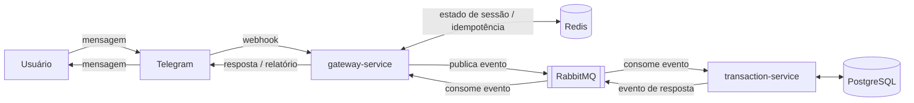

# finance-bot

Bot de finanças pessoais desenvolvido com arquitetura de microserviços em Java e Spring Boot, utilizando comunicação assíncrona por mensageria. Permite gerenciar transações financeiras e gerar relatórios de receitas e despesas.

## Arquitetura

O projeto é dividido em três módulos:

- **`gateway-service`** — microserviço responsável por receber os webhooks do telegram e postar os eventos que serão consumidos pelo transaction-service. Também consome eventos para enviar as respostas para os usuários no chat.
- **`transaction-service`** — microserviço responsável por consumir os eventos postados pelo gateway-service, aplicar as regras de negócio, conduzir os fluxos multi-steps e persistir as transações. Ao fim de cada execução, posta eventos que serão consumidos pelo gateway-service para enviar mensagens de resposta no chat
- **`finance-contracts`** — módulo compartilhado com os contratos (DTOs) usados na comunicação entre os microserviços.

O sistema segue um design **orientado a eventos (event-driven)**: `gateway-service` e `transaction-service` não se comunicam diretamente — a comunicação acontece de forma assíncrona via **RabbitMQ**, com cada serviço publicando/consumindo eventos através dos contratos definidos em `finance-contracts`. O **Redis** é usado para estado de sessão (fluxos conversacionais) e idempotência (inclusive na validação dos webhooks do Telegram). O **PostgreSQL** é o banco de persistência das transações, com migrações via **Flyway**.

### Diagrama



## Stack

- Java 21
- Spring Boot (microserviços)
- RabbitMQ
- Redis
- PostgreSQL + Flyway
- Docker / Docker Compose (ambiente local)

## Funcionalidades

- Registro e gerenciamento de transações via conversa no Telegram
- Fluxos conversacionais multi-etapa
- Geração de relatórios
- Fluxo de exclusão de transações
- Validação de segurança do webhook do Telegram via secret token, com idempotência via Redis

## Rodando localmente

### Pré-requisitos

- Java 21 (o projeto usa a distribuição Corretto)
- Docker e Docker Compose
- IntelliJ IDEA (recomendado — instruções específicas abaixo)

### 1. Suba a infraestrutura com Docker Compose

Os serviços de infraestrutura (RabbitMQ, Redis e PostgreSQL) rodam via Docker, usando o `docker-compose.yml` na raiz do projeto. Para subir todos os serviços:

```bash
docker compose up -d
```

Isso disponibiliza:
- RabbitMQ em `localhost:5672` (management UI em `localhost:15672`, usuário/senha `guest`/`guest`)
- Redis em `localhost:6379`
- PostgreSQL em `localhost:5432` (banco `transactions`, usuário `postgres`, senha `root`)

### 2. Configure o arquivo `.env`

O build local depende de um arquivo `.env` na raiz do projeto, que centraliza as variáveis de ambiente usadas tanto pelo `gateway-service` quanto pelo `transaction-service`. Ele é referenciado diretamente na configuração de execução do IntelliJ (veja o passo 3).

Crie um `.env` na raiz com o seguinte conteúdo (ajustando os valores conforme necessário):

```env
RABBITMQ_HOST=localhost
RABBITMQ_PORT=5672
RABBITMQ_USERNAME=guest
RABBITMQ_PASSWORD=guest
RABBITMQ_SSL_ENABLED=false

REDIS_HOST=localhost
REDIS_PORT=6379

DB_URL=jdbc:postgresql://localhost:5432/transactions
DB_USERNAME=postgres
DB_PASSWORD=root

FLYWAY_ENABLED=true

TELEGRAM_BOT_TOKEN=seu_token_aqui
TELEGRAM_BOT_API_URL=https://api.telegram.org
TELEGRAM_BOT_SECRET_TOKEN=seu_secret_token_aqui
```

> ⚠️ O `.env` contém credenciais e tokens — **nunca** deve ser versionado. Certifique-se de que está no `.gitignore`.

Essas variáveis são referenciadas nos respectivos `application.properties` de cada serviço (`gateway-service` e `transaction-service`).

### 3. Configuração da Run Configuration no IntelliJ

Para rodar cada serviço localmente no IntelliJ, crie uma Run Configuration do tipo **Application** com:

- **JDK**: `21` (Corretto)
- **Main class**: a classe principal do serviço (ex: `com.financebot.gatewayservice.GatewayServiceApplication` para o `gateway-service`)
- **VM/Program arguments**: `-Dspring.config.location=classpath:/application-local.properties`
- **Working directory**: a pasta do serviço (ex: `.../finance-bot/gateway-service`)
- **Environment variables**: aponte para o arquivo `.env` na raiz do projeto (ex: `.../finance-bot/.env`)

Repita a mesma configuração para o `transaction-service`, ajustando a main class e o working directory.

### 4. Instale o módulo `finance-contracts`

O `gateway-service` e o `transaction-service` dependem do `finance-contracts` (os contratos/DTOs compartilhados). Antes de rodar os dois serviços, instale esse módulo no repositório local do Maven:

```bash
cd finance-contracts
mvn clean install
```

### 5. Suba os serviços

Com a infraestrutura no ar (passo 1), o `finance-contracts` instalado (passo 4) e as Run Configurations prontas (passo 3), rode `gateway-service` e `transaction-service` pelo IntelliJ.

### 6. Exponha o `gateway-service` publicamente com ngrok (opcional)

Como o Telegram só envia webhooks para uma URL pública em HTTPS, e localmente o `gateway-service` roda em `localhost`, é preciso expor essa porta publicamente para testar a integração de ponta a ponta. Uma forma simples é usando o [ngrok](https://ngrok.com/):

```bash
ngrok http 8080
```

(ajuste `8080` para a porta em que o `gateway-service` está rodando). O ngrok gera uma URL pública que redireciona para o `localhost`, que pode ser usada ao registrar o webhook do bot (veja a seção "Criando o bot no Telegram").

## Comandos do bot

| Comando | Descrição |
|---|---|
| `/despesa` | Registrar uma despesa |
| `/receita` | Registrar uma receita |
| `/relatorio` | Gerar relatório por período |
| `/deltransacao` | Excluir uma transação |
| `/ajuda` | Ver todos os comandos disponíveis |
| `/cancelar` | Cancelar a operação atual |

## Criando o bot no Telegram

Para obter as credenciais usadas em `TELEGRAM_BOT_TOKEN` e `TELEGRAM_BOT_SECRET_TOKEN`:

1. Abra uma conversa com o **[@BotFather](https://t.me/BotFather)** no Telegram.
2. Envie `/newbot` e siga as instruções (nome e username do bot).
3. O BotFather retornará o **token** de acesso à API — esse é o valor de `TELEGRAM_BOT_TOKEN`.
4. Defina `TELEGRAM_BOT_API_URL` como `https://api.telegram.org` (padrão da API do Telegram).
5. Defina um valor próprio (uma string aleatória e secreta) para `TELEGRAM_BOT_SECRET_TOKEN` — ele é usado para validar que os webhooks recebidos realmente vêm do Telegram, via o header `X-Telegram-Bot-Api-Secret-Token`.
6. Registre o webhook do bot apontando para a URL pública do `gateway-service`, informando o mesmo secret token configurado no passo anterior.

## Segurança

- Validação do webhook do Telegram via secret token
- Idempotência de requisições via Redis

## Licença

Este projeto está licenciado sob os termos da licença [MIT](LICENSE).
